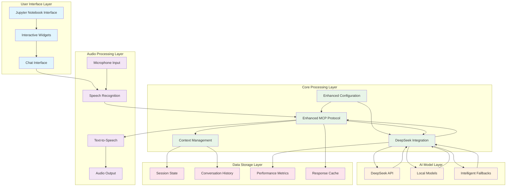
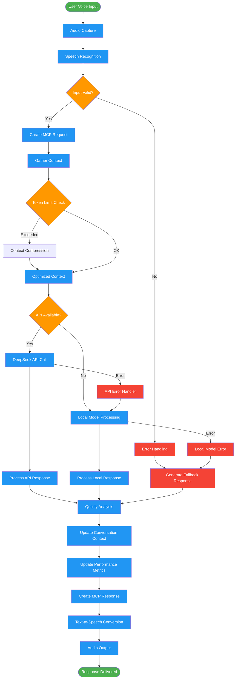
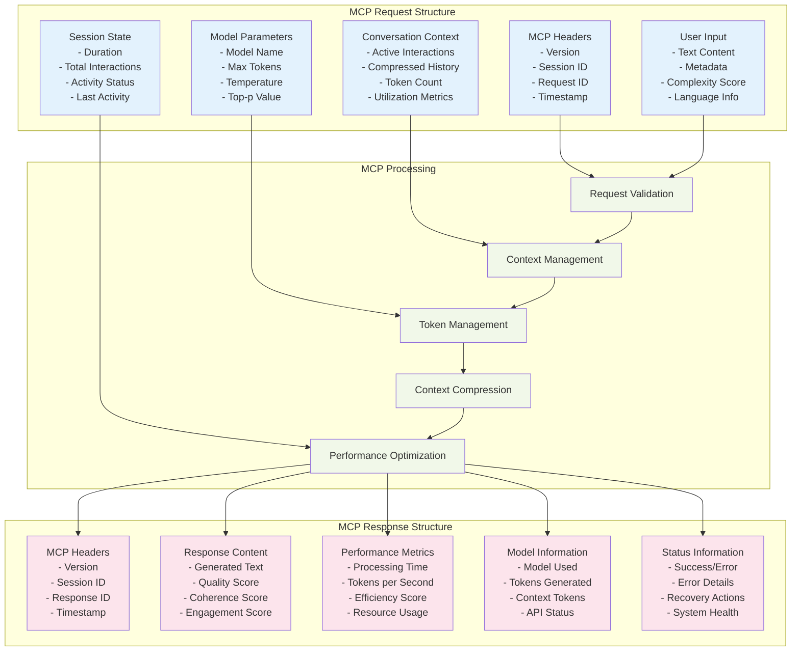
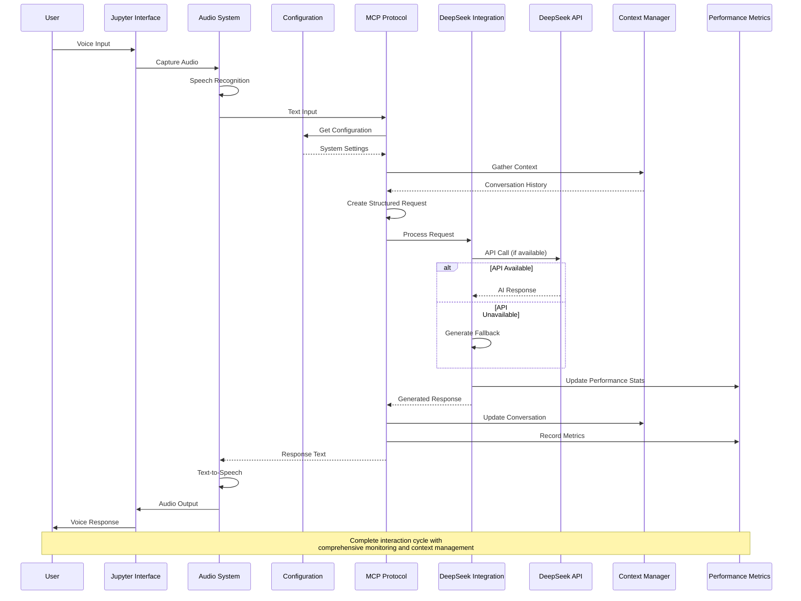
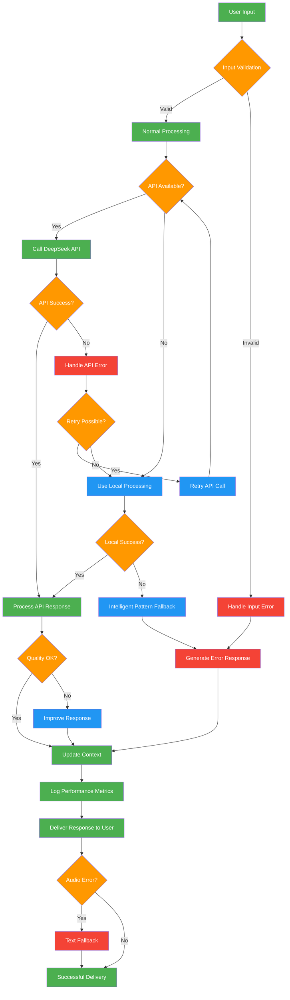
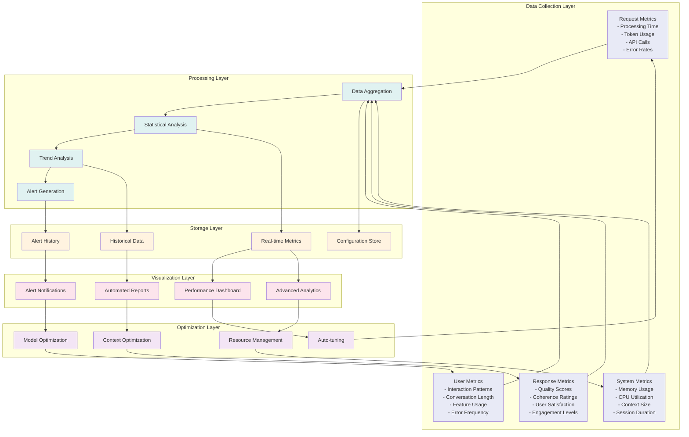
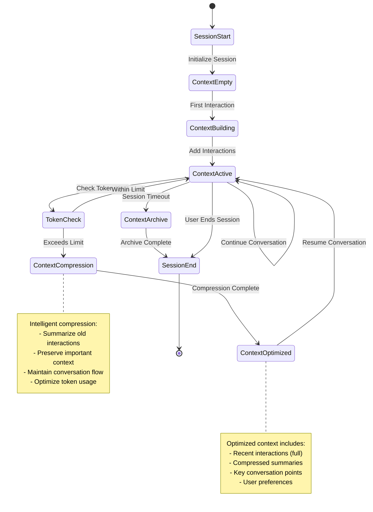
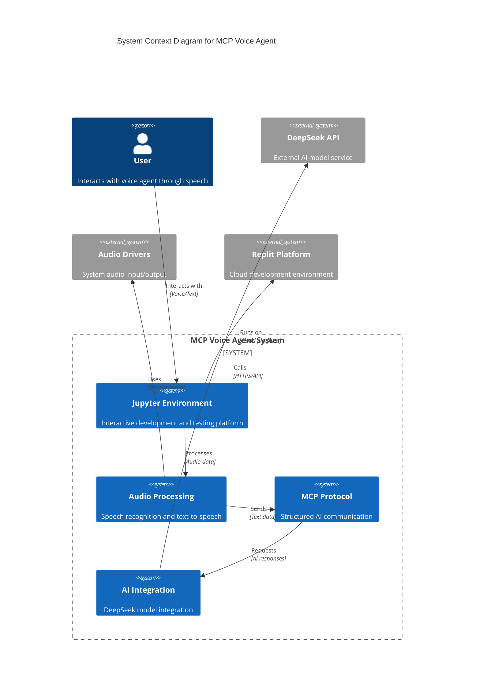
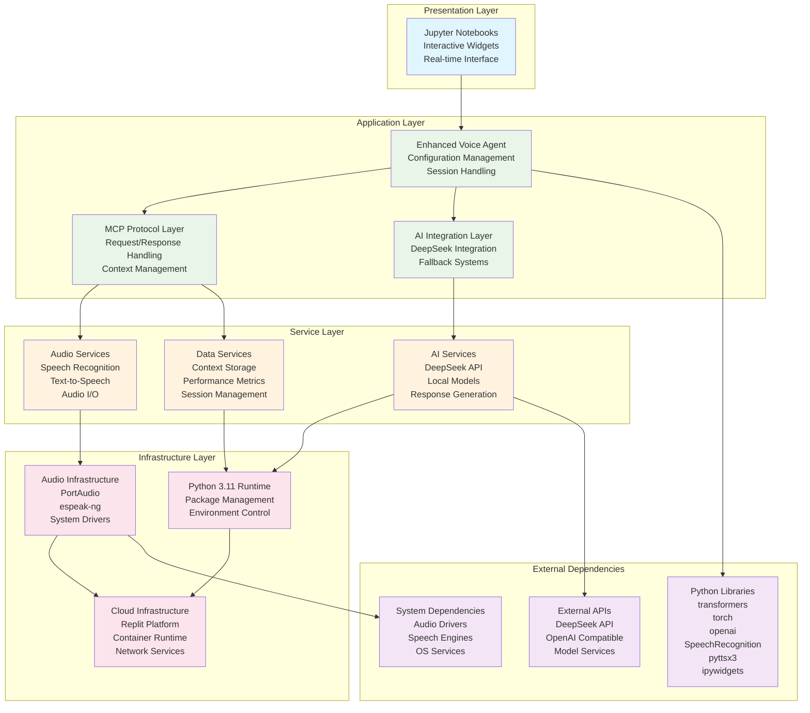

# MCP Voice Agent Architecture Diagrams

This document contains comprehensive Mermaid diagrams that visualize the architecture, data flows, and system interactions of the MCP-Powered Voice Agent.

## 1. System Overview Architecture

## 2. Data Flow Architecture

## 3. MCP Protocol Structure

## 4. Component Interaction Diagram

## 5. Error Handling and Recovery Flow

## 6. Performance Monitoring Architecture

## 7. Context Management Flow

## 8. Deployment Architecture

## 9. Technology Stack Visualization

These diagrams provide a comprehensive visual representation of the MCP Voice Agent system architecture, showing the relationships between components, data flows, error handling mechanisms, and deployment structure. Each diagram focuses on a specific aspect of the system to provide clear understanding of the overall architecture and implementation.
