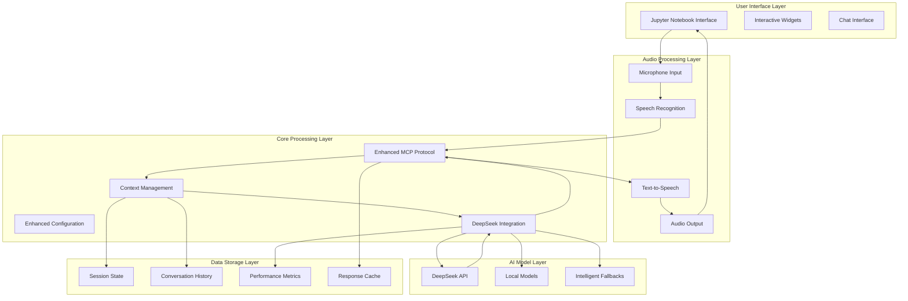
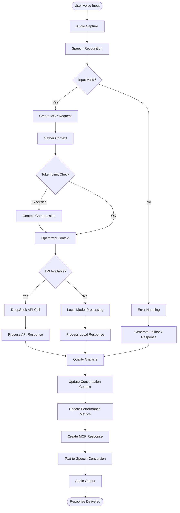
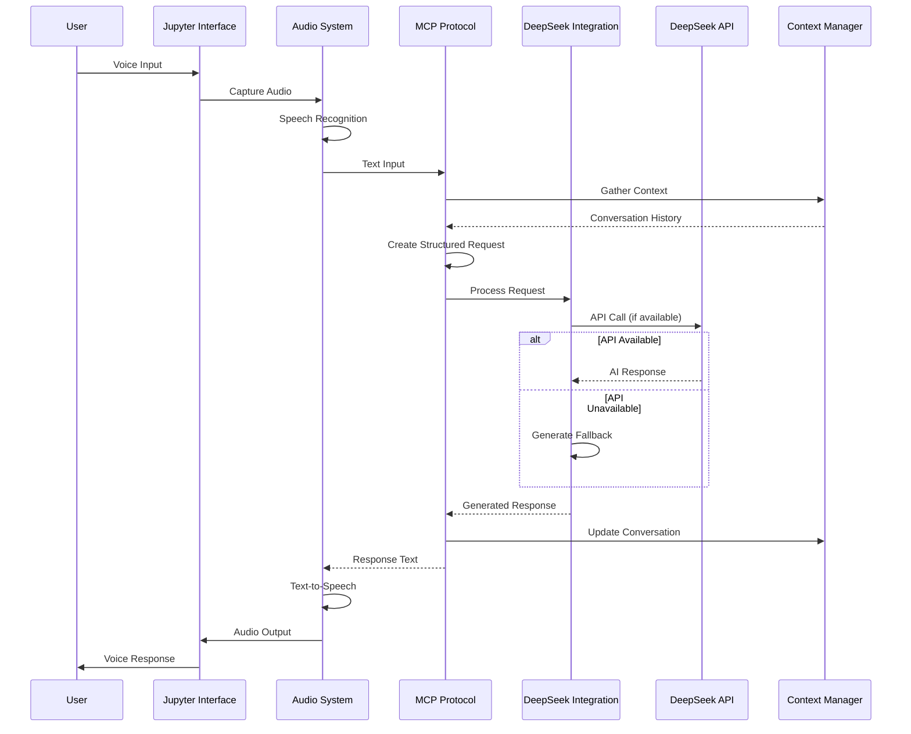

 # MCP-Powered Voice Agent with DeepSeek Integration

## Overview

This repository contains a comprehensive **MCP-Powered Voice Agent with DeepSeek Integration**. It's a sophisticated AI voice assistant that demonstrates the implementation of the Model Context Protocol (MCP) for structured, context-rich AI interactions. The system provides a complete, real-time voice processing pipeline within an interactive Jupyter notebook environment, designed for the research and development of advanced voice-based AI assistants.

## Key Features

-   **Comprehensive Documentation**: Every function and class is thoroughly documented with its purpose, parameters, and implementation details.
-   **Enhanced MCP Protocol**: Implements structured request/response handling, intelligent context compression, session state tracking, and performance monitoring.
-   **Advanced DeepSeek Integration**: Features a multi-tier response generation system (API primary with intelligent fallbacks), context-aware processing, and cost tracking.
-   **Robust Error Handling**: Ensures graceful degradation, with intelligent fallbacks and comprehensive exception management to maintain system stability.
-   **Performance Optimization**: Includes real-time metrics for processing time, memory management via context compression, and resource monitoring.

## System Architecture

The system is built on a linear pipeline architecture, ensuring a clear and sequential flow of data from voice input to voice output.



## Technology Stack

-   **Runtime Environment**: Python 3.11 in Replit cloud platform.
-   **Development Platform**: Jupyter Notebook with `ipywidgets` for an interactive UI.
-   **Audio Processing**: `SpeechRecognition`, `pyttsx3`, `espeak-ng`, and `portaudio`.
-   **AI Processing**: `DeepSeek` (primary), `OpenAI` (fallback), `transformers`, and `torch`.
-   **Protocol Layer**: A custom implementation of the Model Context Protocol (MCP).

## Workflow and Data Flow

The agent follows a structured workflow to process voice interactions, from initial audio capture to the final voice response.

### Data Flow

The following diagram illustrates the step-by-step data flow, including validation, context management, and fallback logic.



### Component Interactions

This sequence diagram shows how the different components of the system interact during a single conversational turn.



## Getting Started

### Prerequisites

-   Python 3.11
-   System dependencies: `espeak-ng` and `portaudio`. These can typically be installed with a package manager (e.g., `sudo apt-get install espeak-ng portaudio19-dev` on Debian/Ubuntu).

### Installation

1.  **Clone the repository:**
    ```bash
    git clone https
